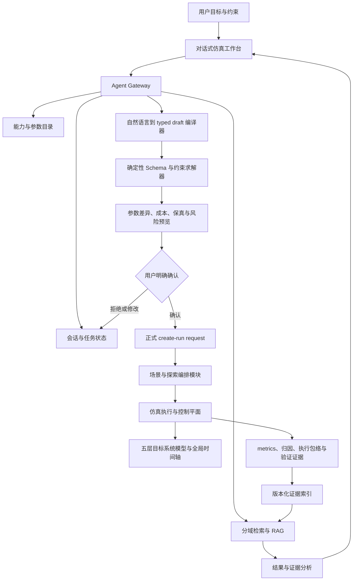
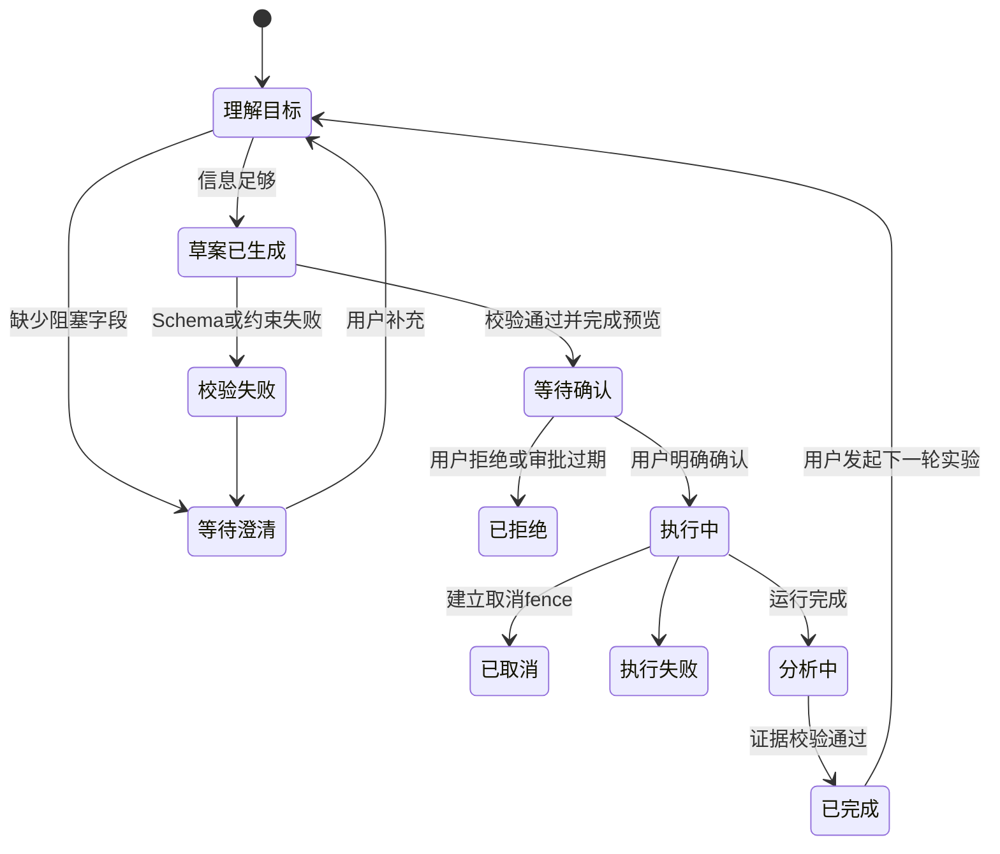

# 基于 Agent 的仿真编排模块完整开发方案

> 调研与代码审计日期：2026-09-06
>
> 文档状态：后续实施方案，不代表新能力或新协议已经发布
>
> 后端审计基线：`09c22c0efff890253a1eacf403c2979f56fd9ba6`
>
> Web 审计基线：`a0d57c8785ff6dad2c0aa9d7110092dbcf50ad7f`

本文回答的核心问题不是“怎样把 Evidence Agent 做得更像聊天机器人”，而是：怎样把 TileSim 演进成一个用户可以用自然语言完成配置、校验、执行、分析和迭代的专业仿真工作台。

目标体验是：用户可以说“我要在某个模型上使用多少张什么卡，采用什么推理引擎，承载什么请求，满足什么 SLO”，Agent 主动发现缺失条件，生成可审计的参数草案，经确定性校验和用户确认后提交正式仿真，再根据带引用的结果设计下一轮实验。

本方案与 [Evidence Agent 使用指南](F9_EVIDENCE_AGENT_USER_GUIDE.md) 和 [Evidence Agent 前沿技术调研与拓展计划](F9_EVIDENCE_AGENT_FRONTIER_EXPANSION_PLAN.md) 配套：前者说明当前页面怎样使用，后者聚焦 Evidence Agent、RAG、工作流和评测技术；本文聚焦“对话式仿真编排”这一完整产品与后端落地路径。

后续 AI 和多个开发 Agent 实施时，以 [基于 Agent 的仿真编排模块文档集](F9_AGENT_ORCHESTRATION/README.md) 为细化规范。该文档集分别定义产品体验、目标架构、能力与 Profile、会话草案、意图编译、确定性规划、可恢复工作流、RAG、工具安全、评测、路线图、面试 Demo、Gap Register，以及可并行开发的模块所有权和独占范围。

跨页面产品入口采用 [全局右侧 Agent 对话栏](F9_AGENT_ORCHESTRATION/16_RIGHT_SIDE_AGENT_COPILOT_PANEL.md)：它在桌面工作台右侧常驻，通过各业务模块提供的只读 Context Envelope 理解当前页面、run 和用户选择，并按正式 capability 逐步开放解释、草案、校验、审批、运行、监控、分析和比较；侧栏本身不拥有业务真源，也不能绕过 contract 和权限。

项目负责人组织多个编码 Agent 实施时，使用 [开发者指导 AI 实施 Agent 模块手册](F9_AGENT_ORCHESTRATION/17_DEVELOPER_AI_EXECUTION_PLAYBOOK.md)。该手册按 Phase 0–7 给出角色、独占范围、必读文档、可复制提示词、调试阶梯、停止条件、交接格式和最终集成门禁。

真正启动某个阶段时，直接复制 [Phase 0–7 多 Agent 提示词包](F9_AGENT_ORCHESTRATION/18_COPY_READY_MULTI_AGENT_PROMPTS.md) 中对应的完整代码块；每个代码块都已包含主 Agent、三个子 Agent、文件边界、调试顺序和验收要求。

## 1. 执行结论

### 1.1 产品定位

建议把当前 Evidence Agent 扩展为“TileSim 仿真研究助手”，但保持两个清晰工作模式：

1. **实验配置与编排**：理解目标、澄清约束、生成参数草案、确定性校验、展示差异、请求确认、提交和监控运行。
2. **结果与证据分析**：检索当前运行证据、解释结果、说明可信边界、比较兼容运行、提出下一轮可验证实验。

这两个模式共享会话、能力目录、运行身份、证据引用和权限体系，但不能混淆职责。模型可以理解语言和组织建议；参数是否合法、某功能是否已建模、运行是否可提交、指标是否可比较，必须由确定性代码和正式契约判定。

### 1.2 四条硬验收轴

| 方向   | 产品要求                                                                     | 工程验收                                                                        |
| ------ | ---------------------------------------------------------------------------- | ------------------------------------------------------------------------------- |
| 实用性 | 能真正完成“描述目标 → 配置 → 运行 → 看懂结果 → 继续实验”的闭环               | 端到端任务完成率、有效运行率、用户从目标到首个可比较结果的时间                  |
| 易用性 | 默认说人话、少填表、只追问关键缺口，复杂字段按需展开                         | 首次成功率、平均澄清轮数、放弃率、键盘/读屏/移动布局门禁                        |
| 专业性 | 显式处理模型、引擎、并行、KV Cache、设备、集合通信、网络、保真度、证据和 SLO | 每个建议绑定能力目录、参数来源、版本、单位、约束和受支持状态                    |
| 准确性 | 不猜配置、不伪造能力、不把合成一致性说成真实保真度                           | Schema/约束硬门禁 100%，citation identity 与 uint64 无损门禁 100%，越权执行为 0 |

任何新功能如果只增加技术名词，却没有让上述至少一个指标可测地改善，不进入默认产品路径。

### 1.3 最重要的架构决定

- Agent 不直接修改仿真器内部状态，也不绕过现有运行入口。
- Agent 先生成“实验草案”；草案必须编译成 Bridge 的正式 create-run request。当前已支持的子集编译为 `tilesim.bridge.create_run_request.v1`，新增字段只能进入 Bridge 正式发布的后继版本，不能另造第二套旁路执行协议。
- 大模型不负责数值约束求解。显存估算、并行度可行性、KV 容量、设备与端点映射、候选预算、单位换算和 SLO 比较都由确定性计算器完成。
- 缺少模型、设备、引擎或网络 profile 时，Agent 必须追问或给出带状态的候选，不能猜一个默认值。
- 高成本或写操作必须展示完整参数差异、预计运行规模、证据范围和副作用，并由用户明确确认。
- 第一阶段采用单 Agent 的 typed graph workflow。只有当权限、上下文或评测证明需要隔离时，才拆有限多 Agent；不以 Agent 数量作为成熟度指标。
- RAG 分四类索引，结构化配置与数值证据优先精确检索，不能把所有数据塞进一个普通向量库。

## 2. 当前真实能力审计

### 2.1 后端已具备的基础

当前后端已经具备适合承载 Agent 的确定性骨架：

- Analytical 端到端功能闭环和已建模路径的确定性 DES；
- 分区 DES replay、单进程差分、检查点与恢复；
- 网络信用流控局部 Cycle 窗口；
- 六类 Trace package 的完整性、来源和 SHA 校验；
- 运行级 metrics、尾延迟归因、执行包络、验证和 run-bound evidence；
- 网络与硬件资源范围的候选生成、Analytical 筛选和选择性 DES 提升；
- 工作负载描述语言的任务场景、系统结构、执行过程和来源约束；
- vLLM、SGLang、TensorRT-LLM 的版本化推理引擎语义 profile 基础；
- 一个严格、固定步骤的结构化 Agent 编排入口。

仓库进度记录显示审计基线曾通过 62/62 CTest。本文没有把历史测试记录重新解释为真实设备校准或独立留出验证。

### 2.2 当前“Agent 编排”实际是什么

`include/Core/AgentOrchestration.h` 和 `src/Core/AgentOrchestration.cpp` 当前定义：

- 输入：`tilesim.agent.structured_intent.v1alpha1`；
- 输出：`tilesim.agent.orchestration_report.v1alpha1`；
- 唯一动作：`run_range`；
- 主要字段：执行模式、旧兼容边界、Trace 和 topology 路径、Trace kind、来源、校准等级、允许结论范围、保真度策略和产物查询；
- 固定工具序列：parse → validate → freeze → execute → query artifacts；
- intent 上限 1 MiB，Trace 和 topology 各 64 MiB；
- 输入被冻结并生成 digest，执行前后检查内容是否改变；
- 自报 calibrated 或 held-out 状态会因缺少认证校准绑定而 fail closed。

这是一条可靠的“结构化意图执行器”，还不是语言 Agent：它没有自然语言解析、参数目录、模型/卡型 profile、多轮澄清、审批、异步会话或跨运行比较。

### 2.3 当前参数能力矩阵

下表区分“字段存在”“能够校验”“正式 Web 暴露”和“真实参与当前执行”。这是后续 Agent 不夸大能力的基础。

| 用户想配置的内容   | 当前代码事实                                                                                                        | 当前可用程度                                                                                 | 后续缺口                                                       |
| ------------------ | ------------------------------------------------------------------------------------------------------------------- | -------------------------------------------------------------------------------------------- | -------------------------------------------------------------- |
| 模型名称           | 工作负载描述语言有 `model_id`；runtime request 也可带 `model_id`                                                    | 主要是身份字段，尚无正式模型容量/profile 目录                                                | 模型结构、参数量、dtype、KV 形状、MoE、版本和证据来源目录      |
| 推理引擎           | 工作负载描述语言允许 vLLM、SGLang、TensorRT-LLM；引擎 profile registry 有三个固定语义版本                           | 后端可校验有限 profile；Web create-run 未正式暴露引擎选择                                    | 把 profile 与正式运行配置、功能开关和版本兼容性连接起来        |
| GPU/加速卡型号     | topology 有 `device_type`，工作负载描述语言有 `device_ids`                                                          | 可描述身份，但没有 H100/A100 等版本化性能与显存 profile 真源                                 | 设备 catalog、实测/模型化参数、GPU 参与方式和适用结论范围      |
| 卡数               | `device_ids` 数量、topology devices、participants 可表达；并行度可做一致性校验                                      | 自定义 JSON 可描述，普通表单未暴露；不等于完整多卡性能模型已闭合                             | 卡数到 placement、通信、显存和执行片段的完整 lowering          |
| 张量并行           | 工作负载描述语言有 tensor parallel degree；runtime request 有 `tp_degree`                                           | 有局部校验和执行字段；普通表单未暴露                                                         | 与模型 profile、collective、设备 placement 的统一编译          |
| 流水线/专家并行    | 工作负载描述语言有 pipeline/expert parallel degree 和 MoE 字段                                                      | 当前主要是描述与约束，尚非完整 Web 执行面                                                    | 推理引擎、执行片段、KV、集合通信、网络的累计闭环               |
| 请求数量与长度     | 工作负载描述语言有 request count、prompt/decode 范围、arrival process；custom runtime trace 可逐请求设置            | 自定义 synthetic JSON 可用；普通表单仅有 message size multiplier                             | 分布模板、到达率/突发/并发/SLO 的正式参数目录和生成器          |
| 调度与 batch       | Web 已暴露 scheduler、max batch size；runtime trace 还支持 max active、prefill starvation 等更多字段                | 三个表单调度枚举和 max batch size 会写入正式运行输入                                         | 引擎 profile 约束、更多字段 descriptor、默认值来源和冲突解释   |
| KV Cache           | Web 已暴露 capacity；runtime trace 还有 page、fragmentation、watermark、handoff 等                                  | capacity 会写入运行输入；更细策略只有 custom JSON                                            | 逻辑策略与物理页/容量/驻留/迁移的正式 profile 和可配置边界     |
| 网络               | Web 已暴露纵向/横向扩展带宽和延迟；custom topology 支持设备、链路、域、binding                                      | 当前最完整的可执行参数域                                                                     | 拓扑模板、路由/传输 profile、校准 receipt 和规模化约束         |
| 设计空间           | strict candidate manifest 支持 bandwidth、latency、oversubscription、request count、message bytes、release interval | 当前候选真实执行范围是网络与硬件资源、固定双端点；其余字段正式标记 `unresolved_not_executed` | 只有相关模块 lowering 闭合后才扩展联合搜索                     |
| 保真度             | Bridge 正式允许 default/DES；gpu_free 可用；resolved fidelity 来自执行包络和验证报告                                | 可用但必须区分 requested、resolved 和 execution mode                                         | 普通 Cycle、GPU-assisted、GPU-in-loop 的能力发布和证据门禁     |
| 真实校准与容量规划 | 校准资产、验证报告、provenance/claim scope 契约已有基础                                                             | 缺少 H100/网络真实校准和独立 held-out 资产                                                   | 在此之前只能给探索、合成一致性或条件预测，不能给“准确部署结论” |

### 2.4 当前 Web 正式运行面

`tilesim.bridge.experiment_descriptor.v1` 当前只公开一个 synthetic runtime 场景、`gpu_free`、default/DES 和八个普通表单参数：

- 工作负载：消息大小倍率；
- 推理引擎与服务运行时：batch scheduler、max batch size、KV capacity；
- 网络与硬件资源：纵向扩展网络带宽/延迟、横向扩展网络带宽/延迟。

执行语义、KV Cache 物理语义、设备性能和集合通信的更多参数在正式表单中仍是 `not_exposed`。custom JSON 可以表达更多 runtime 和 topology 字段，但“Schema 接受”不等于“完整物理影响已闭合”，Agent 必须逐字段读取 capability status。

### 2.5 当前 Evidence Agent 边界

当前 Evidence Agent 是单轮、当前 run、当前 request 的证据解释器：

- descriptor 最多声明四类任务；
- 前端不固定具体厂商模型，实际 provider/model identity 由 Bridge descriptor 发布；
- 不支持 Agent 主动澄清、多轮对话、跨 run 比较、工具执行、SSE 或取消；
- live Provider capability probe 可用不等于完成 live acceptance；截至现有 F9 记录，live model repetitions 为 0；
- request、response、citation、snapshot 仍是 v1，descriptor identity 仍是 `tilesim.bridge.evidence_agent_descriptor.v2`。

因此，不能在现有前端中用本地聊天历史或伪造工具按钮模拟本方案的新能力。新能力必须先有 Bridge 正式契约。

## 3. 目标用户体验

### 3.1 一次理想对话

用户：

> 我想部署 Qwen2.5-72B，用 8 张 H100，vLLM，线上请求大约每秒 12 个，输入大多 2K token、输出 256 token，希望 P99 不超过 2 秒。帮我设置参数并比较两种并行方案。

Agent 不应立即生成一大段答案，而应完成以下动作：

1. 从正式目录确认是否存在精确的模型、引擎、设备和拓扑 profile。
2. 标出“8 张 H100、vLLM、12 requests/s、2K/256 token、P99 2 s”为用户明确输入。
3. 追问真正阻塞执行的缺口，例如 H100 具体规格、量化/精度、节点内外分布、推理引擎语义版本、请求长度分布和 burst 假设。
4. 如果某 profile 不存在，明确显示“当前未建模”，提供可支持的替代场景，而不是猜数值。
5. 生成两个实验草案，例如 TP=8 与 TP=4/PP=2，并由确定性规则检查卡数、模型切分、KV 容量、collective participants 和 topology。
6. 展示每个方案相对基线的参数 diff、运行规模、预计耗时等级、requested fidelity、证据范围和已知缺口。
7. 等待用户明确选择并确认后，才提交正式 create-run request。
8. 监控运行状态，完成后展示结论、依据、限制和下一步；每条结果引用正式 artifact。
9. 如果比较条件兼容，Agent 建议下一轮缩小参数范围；如果不兼容，说明为何不能直接比较。

### 3.2 用户界面信息层级

普通用户默认只看：

- 我理解的目标；
- 还需要你确认的问题；
- 推荐的 1–3 个可运行方案；
- 每个方案改变了什么、为什么；
- 预计等待和结论可信范围；
- 运行后的结论、依据、限制、下一步。

高级用户按需展开：

- 完整 JSON Pointer、schema identity、profile revision；
- 参数来源、默认值来源和 derivation；
- run、artifact、SHA-256、stable subject、snapshot digest；
- 工作流 event、tool input/output digest 和 approval record。

开发过程中的内部提醒、契约实现说明和为 AI 编码准备的小字不得堆在普通页面。它们应进入正式帮助文档、审计详情或开发者日志。

### 3.3 两种入口

建议提供两个清晰入口，而不是把所有能力塞入一个空白聊天框：

- **从目标开始**：用户描述部署或评估目标，Agent 生成实验。
- **从当前结果继续**：用户基于一个已完成 run 询问原因、可信度、对比或下一步。

两者都保留对话，但页面始终显示当前绑定的模型/硬件 profile、run、snapshot 和草案状态，避免用户不知道 Agent 正在基于什么回答。

## 4. 目标架构

关键边界：

- 五层目标系统仍是工作负载与请求、推理引擎与服务运行时、执行语义与并行、资源语义、网络与硬件资源；
- 仿真执行与控制平面是独立控制平面，不是第六层；
- KV Cache、设备性能和集合通信是资源语义层的并列模块；
- 网络完成/反压 → 资源操作 → 执行片段依赖 → 模型调用 → 推理引擎 → 请求指标的反馈链必须保留；
- Agent 只围绕可审计的确定性流程编排，不定义新的物理语义。

## 5. 需要新增的核心能力

### 5.1 能力与参数目录

这是整个方案的 P0。没有它，Agent 只能靠 prompt 猜配置。

每个参数至少声明：

- stable field identity 和正式 request JSON Pointer；
- 所属中文模块、数据类型、单位、范围、枚举和是否必填；
- 默认值是否存在、默认值来源和 revision；
- applicable scenario、input mode、source mode、GPU participation mode；
- 依赖、冲突、组合约束和确定性 validator；
- 支持状态：`not_exposed`、`accepted_not_executed`、`executed_functional`、`calibrated`、`held_out_validated`；
- 证据来源、适用结论范围和最后验证时间；
- 从用户自然语言到参数的同义词、示例和歧义提示。

目录必须由后端/Bridge 发布，前端和模型都只是消费者。模型不能通过看模板 JSON、CLI help 或历史运行来推断某参数“应该支持”。

### 5.2 模型 profile

至少包含：

- 精确模型 ID、版本、架构族、dense/MoE；
- 参数量、层数、hidden size、attention/KV head、expert 数与 top-k；
- 支持的 dtype/quantization 和权重来源；
- 单 token KV 需求、激活/临时内存模型和计算图/分区引用；
- 支持的 TP/PP/EP 范围与约束；
- 模型字段来自公开配置、实测、生成还是推断；
- 允许用于功能探索、条件预测还是已校准验证。

Agent 可以根据 profile 生成候选，但不得把参数量除以卡数这种粗略结果直接当作可部署结论。显存可行性必须包括权重、KV、激活、运行时开销、安全余量和碎片化，并给出计算明细。

### 5.3 推理引擎 profile

在现有 vLLM/SGLang/TensorRT-LLM 语义 profile 基础上扩展：

- 精确版本和运行模式；
- decision triggers、owned state、ordered decisions、tie-breaking；
- batching、chunked prefill、prefix cache、preemption、disaggregation、speculative decoding 等逐项支持状态；
- KV 逻辑策略与物理 KV Cache 模块的接口；
- 输出的模型调用和执行片段约束；
- 与模型 profile、并行策略、设备 profile 的兼容矩阵；
- 未建模功能必须显式 fail closed。

### 5.4 设备与网络 profile

设备 profile 不只是一串“H100”文字，应包含版本化的：

- 显存容量、带宽、计算能力和适用 dtype；
- 设备 timing model 或测量资产 identity；
- 节点/超节点 placement 能力；
- 支持的纵向扩展网络、横向扩展网络和 collective library 组合；
- `gpu_free`、`gpu_assisted_trace`、`gpu_in_loop` 的支持状态分别声明；
- driver、runtime、compiler、collective library、profiler 和 calibration receipt。

网络/topology profile 至少声明设备、endpoint、domain、link、routing、transport、failure policy、带宽、延迟、oversubscription、buffer/credit 和证据范围。用户说“8 张卡”时，Agent 必须知道是一个节点内、两个节点还是其他结构；否则必须澄清。

### 5.5 工作负载模板

把“什么样的请求”转为普通语言可配置对象：

- 请求总量、到达率和 arrival process；
- prompt/decode 长度分布，而不只是 min/max；
- 并发、burst、优先级、tenant mix；
- prefill/decode/混合比例；
- session/prefix reuse、KV handoff 和 disaggregation 条件；
- SLO：TTFT、TPOT、P95/P99、throughput、资源或成本上限；
- 测量窗口、warmup、random seed；
- Trace source 和 GPU participation mode 分开设置。

首版只提供少量经过测试的模板：离线批处理、稳定在线流量、突发在线流量、长上下文和 MoE。自由分布编辑放在高级模式。

### 5.6 typed experiment draft compiler

语言模型的输出不是 run request，而是一个 typed draft：

- 用户明确值；
- 目录默认值；
- Agent 建议值；
- 确定性派生值；
- 尚未确认值；
- 不受支持值；
- 每个字段的来源、置信状态和解释；
- 目标函数、约束、候选集合和预计运行预算。

编译器只允许目录中存在的字段。未知字段、过期 revision、单位不明确和组合冲突全部 fail closed。

### 5.7 确定性约束与预检

预检至少包含：

- 模型权重、KV、激活和运行时余量是否能放入设备；
- TP × PP 是否超过可用设备，EP 是否满足专家数整除等约束；
- 模型、引擎版本和 feature 是否兼容；
- device → endpoint、collective participants、network domain 是否完整；
- request 分布、测量窗口、并发和 batch 是否自洽；
- uint64 ps/bytes/count 是否在全链路无损范围内；
- source mode、calibration level、claim scope、requested fidelity、resolved fidelity 和 execution mode 是否分离；
- 候选数量、请求数量、预计事件数、超时和资源预算是否受控；
- 当前后端是否真正执行每个候选参数。

预检输出按“错误、必须确认、建议、信息”分级。错误阻止提交；必须确认项由用户决策；建议不得偷偷变成默认值。

### 5.8 审批与写操作边界

审批卡必须展示：

- 基线与草案的完整语义 diff；
- 将创建多少个 run、每个 run 的 request count 和 fidelity；
- 预计运行时长等级和外部 Provider 预算；
- 允许结论范围和不可验证部分；
- 幂等 key、草案 digest、capability/profile revisions；
- 可取消性和失败后的恢复策略。

批准前不得创建 run。批准、拒绝、过期、取消和执行完成是不同终态。Agent 不得复用过期批准，也不得在参数变化后沿用旧批准。

## 6. 会话、任务与工作流

### 6.1 状态流

### 6.2 必须版本化的数据对象

正式实现前需要 Bridge 发布以下契约，不得由前端自行模拟：

- conversation/session；
- turn 与 parent turn；
- structured goal；
- experiment draft 与 draft revision；
- clarification request/answer；
- deterministic validation report；
- approval envelope；
- operation、typed event、checkpoint；
- cancellation fence；
- tool call record；
- comparison set 和 comparability report。

每轮都绑定 capability revision、profile revisions、run/snapshot、provider/model/prompt/policy revision。模型或目录版本变化后，旧草案必须重新校验。

### 6.3 持久化与隐私

允许持久化：

- 会话/轮次 identity 和最小用户可见摘要；
- 结构化目标、草案、验证结果、批准状态和 digest；
- run/artifact/snapshot 引用；
- typed workflow event 和恢复必需的最小状态；
- model/tool/policy revision、延迟、token/cost 汇总和错误码。

默认不持久化：

- Provider credential；
- hidden reasoning；
- Provider raw response；
- 未经授权的完整 artifact payload；
- 无必要的完整用户问题；
- validated claims 的额外长期副本。

用户问题若因产品需要保存，必须有独立 retention class、明确期限、删除路径和 UI 告知，不能沿用当前 Evidence Agent 的非持久化假设静默升级。

### 6.4 Durable workflow 选型

建议分两步：

1. 先用 Bridge 自有 typed state machine 验证契约、状态和恢复语义；
2. 当异步、人类确认、取消和 crash/resume 需求稳定后，对 LangGraph 与 Pydantic AI durable execution 做一次有指标的 bake-off。

推荐默认候选是 LangGraph，因为其官方定位明确支持 deterministic/agentic step 混合、persistence、human-in-the-loop 和 long-running stateful workflow。Pydantic AI durable execution 作为更强类型和多 durable backend 的对照候选。最终选择依据是 Windows/WSL 可维护性、checkpoint 可迁移性、故障注入、可观测性和依赖成本，不依据框架热度。

无论选什么框架，TileSim 的 JSON Schema、idempotency、approval、citation 和 retention contract 都是业务真源，不能变成框架内部不可见状态。

## 7. RAG 与知识系统

### 7.1 四个独立索引

| 索引               | 内容                                                               | 首选检索                                             | 禁止事项                                 |
| ------------------ | ------------------------------------------------------------------ | ---------------------------------------------------- | ---------------------------------------- |
| 参数与能力索引     | Schema、parameter descriptor、model/engine/device/topology profile | exact ID、枚举、过滤、依赖图                         | 用向量相似度决定正式参数值               |
| 当前运行证据索引   | metrics、归因、执行包络、validation、run-bound evidence            | exact subject/Pointer、metadata、BM25，必要时 rerank | 跨 run 混入、重算指标、改写 atomic claim |
| 架构与帮助文档索引 | 公开架构、契约、用户指南和术语                                     | BM25 + embedding + rerank；可选 contextual chunk     | 索引项目所有者私有主设计资料             |
| 历史运行经验索引   | 允许保留的输入 digest、参数 diff、指标和失败类型                   | 条件过滤、相似配置、可比性 gate                      | 把历史相关性当因果结论或真实校准         |

### 7.2 检索策略

采用逐级启用的 ladder：

1. stable ID、JSON Pointer、模型 ID、设备 ID、错误码和参数名 exact lookup；
2. capability、scenario、source、fidelity、run、snapshot 等 metadata filter；
3. BM25 lexical baseline；
4. 只有冻结评测集证明有收益时才加入 embedding；
5. 多路召回用明确、版本化的 fusion；
6. 只有离线 ablation 证明收益时才加入 reranker；
7. 最后再次执行 permission、identity、claim-scope 和 citation gate。

Anthropic 的 Contextual Retrieval 说明了 BM25、embedding、contextual chunk 和 reranking的组合价值，但其公开实验百分比不能直接当作 TileSim 指标。TileSim 必须在自己的数据集上测 recall、latency 和成本。

### 7.3 是否使用 GraphRAG

GraphRAG 适合跨大量架构文档做全局主题、局部实体和关系检索，不适合替代当前运行的精确数值证据索引。

建议：

- 首版不引入 GraphRAG；
- 当公开文档量和跨模块关系问题使 BM25 + embedding baseline 明显不足时，再做离线 prototype；
- 图中的实体可以是模块、contract、profile、parameter、artifact 和 stable subject；
- 任何图摘要仍不能替代原始 contract 或 artifact 引用；
- 只有在冻结 validation set 上取得显著收益且可解释性/成本门禁通过才发布。

### 7.4 防御 artifact prompt injection

- artifact 和文档一律是不可信数据，不是系统指令；
- retrieval record 将“内容”和“指令”分离；
- 工具权限由 policy engine 决定，不接受文档中的授权文字；
- 模型只能从 allow-listed evidence set 引用；
- tool input 经过 closed Schema 和独立 validator；
- 使用 AgentDojo 类任务构造恶意 artifact、越权调用、数据外传和 indirect prompt injection 回归；
- injection、permission bypass、cross-run leakage 和 duplicate side effect 的成功次数必须为 0。

## 8. 从对话到参数的专业推理

### 8.1 参数来源优先级

从高到低：

1. 用户本轮明确选择；
2. 已绑定真实 Trace 或运行清单事实；
3. 正式 versioned profile；
4. 正式 scenario template 的显式默认值；
5. Agent 建议候选。

低优先级不能静默覆盖高优先级。任何冲突必须在 diff 中显示。

### 8.2 主动澄清策略

每轮只问 1–3 个真正阻塞的问题，优先级为：

1. 会改变能否执行的问题；
2. 会改变卡数、显存、并行或拓扑可行性的问题；
3. 会改变来源/保真/允许结论的问题；
4. 会显著改变运行预算的问题；
5. 只影响命名或展示的问题最后再问。

可提供候选按钮和简短影响说明，但不能把“推荐”伪装成用户已确认。

### 8.3 确定性计算器

建议新增独立、可测试的 calculators：

- model memory planner；
- KV capacity planner；
- parallelism and placement solver；
- request distribution generator；
- collective and communication demand preflight；
- topology compatibility checker；
- simulation budget estimator；
- SLO feasibility/comparison evaluator；
- provenance and claim-scope resolver。

这些计算器输出输入、公式/规则 revision、结果、范围和失败原因。语言模型只负责将结果解释给用户。

### 8.4 推荐与优化的边界

Agent 的“推荐”分三级：

- **配置建议**：根据 profile 和约束选择可运行候选；
- **实验建议**：说明需要运行哪些候选才能回答问题；
- **结果建议**：只基于已完成运行和正式证据提出下一轮验证方向。

没有运行证据时不能说“方案 A 性能更好”。真实校准和 held-out 验证完成前，对“多少张卡够用”只能输出带假设的可执行候选和条件预测。

### 8.5 搜索与设计空间

扩展顺序必须跟随仿真能力闭合：

1. 先做模板 + 规则生成少量候选；
2. 当前网络与硬件资源 lane 使用已有 Analytical 筛选和选择性 DES 提升；
3. 推理引擎、执行语义、KV Cache、设备和集合通信参数真正进入同一正式 run request 后，才做跨模块联合候选；
4. 再考虑多目标 Bayesian optimization、successive halving 或 surrogate；
5. 所有优化器只读取正式指标和不确定性，不允许 LLM 自行打分排序；
6. 候选比较必须通过 comparability gate，保留输入 diff、fidelity 和 provenance。

## 9. 工具与多 Agent 设计

### 9.1 工具分级

| 等级         | 示例                                                   | 权限                                            |
| ------------ | ------------------------------------------------------ | ----------------------------------------------- |
| 只读精确工具 | 查询能力、profile、Schema、run、artifact、证据 Pointer | 自动允许，仍需 run/snapshot 隔离                |
| 纯计算工具   | 显存、并行、预算、候选生成、可比性检查                 | 自动允许，必须确定性和无副作用                  |
| 草案工具     | 创建/修改 experiment draft                             | 可自动执行，不得创建 run                        |
| 写工具       | 提交 run、取消 run、删除会话或索引                     | 必须策略校验；创建/删除等高影响操作要求用户确认 |
| 外部工具     | MCP、远程 catalog、第三方 Agent                        | 默认关闭，逐个 capability、身份和权限发布       |

Agent 永远不获得通用 shell、任意文件读取、任意 URL 抓取或数据库写权限。

### 9.2 MCP 的使用位置

MCP 官方协议提供 capability/version discovery、tools、resources、prompts、通知和长任务进度机制。TileSim 可以在内部契约稳定后提供：

- profile/catalog resources；
- read-only run/artifact resources；
- validate draft、estimate budget 等纯计算 tools；
- 经批准的 create-run tool。

MCP 是外部互操作适配层，不替代 TileSim 内部 canonical contract。内部工具先通过普通 typed service 验收，再决定是否加 MCP adapter。

### 9.3 何时拆多 Agent

首版保持一个 Orchestrator graph，并在节点层分工。只有出现以下明确收益时才拆：

- 配置规划与证据分析需要不同权限；
- 长文档研究和当前运行证据需要不同上下文窗口；
- 独立 reviewer 能在冻结评测集上提高错误发现率；
- 并行候选分析能显著降低总时延且不破坏预算。

后期最多考虑四个有限角色：配置助手、实验规划器、证据分析器、验证 reviewer。所有角色共享正式状态机和权限层，不允许自由聊天式互相委托写操作。

A2A 仅在确实需要让外部 Agent 调用 TileSim 时增加 gateway。它不是单体内部多 Agent 的必需品。

## 10. 前端方案

### 10.1 页面结构

建议将未来页面组织为一个连续工作区：

1. **目标区**：自然语言目标、当前 run/场景上下文；
2. **澄清区**：1–3 个关键问题，支持候选和自由输入；
3. **实验草案区**：按中文模块分组展示参数，标出来源和状态；
4. **可行性区**：错误、冲突、显存/并行/拓扑/预算检查；
5. **确认区**：参数 diff、成本、保真与允许结论范围；
6. **运行区**：排队、执行、恢复、取消、失败和产物进度；
7. **结果区**：结论、依据、限制、下一步；
8. **审计抽屉**：profile、SHA、Pointer、subject、contract 和 workflow event。

### 10.2 新手与专业模式

- 新手模式使用“模型、卡、请求、目标”四组普通语言卡片；
- 专业模式显示全部正式参数，但仍由 descriptor 驱动；
- 两种模式编辑同一个 typed draft，不维护两套 payload；
- 页面始终区分“你填写的”“目录默认的”“Agent 建议的”“系统计算的”；
- 不支持项显示在冲突/能力详情中，不用大段开发小字干扰主流程；
- 用户可以随时查看“最终将提交什么”，预览对象与真实提交对象来自同一个 builder。

### 10.3 易用性细节

- 给出高质量示例目标，而不是空白聊天框；
- 支持从当前实验复制成草案，再用自然语言修改；
- 显示“为什么要问这个问题”和每个选项的影响；
- 每次只要求用户解决当前阻塞项；
- 错误精准聚焦到对应字段，提供可执行修复；
- 不自动覆盖用户已编辑值；
- 草案、验证、审批、运行和结果使用明显不同状态；
- 完整键盘操作、焦点恢复、读屏通知、窄屏和 reduced-motion 验收。

## 11. 分阶段实施路线图

### Phase 0：能力真源与现状收口（2 周）

目标：先让系统准确知道“能做什么”，不新增聊天幻觉面。

后端：

- 汇总工作负载、推理引擎、执行语义、KV Cache、设备、集合通信、网络参数；
- 为每个字段标记 accepted/executed/calibrated 状态；
- 建立 model、engine、device、topology、workload template 的最小 profile Schema；
- 给出字段到现有 run request/lowering/产物的 traceability matrix。

Bridge/前端：

- 扩展 capability catalog 的设计稿和 fixture；
- 当前 UI 只消费正式发布字段，不推断隐藏能力；
- 保持现有 Evidence Agent 和 create-run identity 不变。

门禁：

- 每个 exposed 参数都有执行测试；
- 每个未执行字段都不能出现在推荐候选；
- capability/schema/revision drift fail closed。

面试 Demo：打开能力检查器，展示“字段存在”和“真实执行”为什么不同。

### Phase 1：当前正式参数面的对话式草案（2–3 周）

目标：用户能用自然语言配置现有八个参数和受控 custom runtime/topology 子集，但 Agent 不能创建 run。

交付：

- structured goal 和 experiment draft 原型；
- exact parameter retrieval；
- typed compiler；
- deterministic validator；
- 参数来源、diff 和 request preview；
- 至少 100 条中文/英文意图与歧义评测。

门禁：

- draft → `tilesim.bridge.create_run_request.v1` 与手工表单 builder 字节级等价；
- 未声明参数拒绝率 100%；
- 数值、单位、枚举和 JSON Pointer 准确率 100%；
- 无 run side effect。

面试 Demo：一句话修改调度、batch、KV 和网络参数，页面生成与正式表单完全一致的草案。

### Phase 2：模型、设备、并行和工作负载编译（3–5 周）

目标：支持用户真正关心的“什么模型、多少张什么卡、怎样的请求、什么并行方式”。

前置依赖：

- 工作负载描述语言到六类 Trace package/托管运行的正式转换闭合；
- 模型、设备和引擎 profile 有版本与证据；
- TP/PP/EP、KV、集合通信和 topology 的执行影响有累计链测试。

交付：

- profile catalog；
- workload template；
- memory/KV/parallel/placement calculators；
- Bridge 正式发布 create-run successor 或正式 workload-description intake；
- 高级参数编辑器和可行性报告。

门禁：

- 不可行配置全量 fail closed；
- draft 编译后能从工作负载输入累计到网络与请求指标；
- 模型/设备 profile 缺失时必须澄清；
- synthetic 结论不升级。

面试 Demo：输入模型、8 张卡和流量目标，Agent 发现一个并行度冲突并给出两个可运行候选。

### Phase 3：正式多轮澄清与人工确认（2–3 周）

目标：从“单次生成草案”升级为可恢复的多轮配置任务。

交付：

- conversation/turn/draft/approval 契约；
- 每轮 snapshot 和 profile revision binding；
- approval expiry、reject、modify、resubmit；
- retention/delete contract；
- 前端对话与参数草案双向联动。

门禁：

- turn 顺序、并发编辑和 stale 隔离；
- 参数变化立即使旧批准失效；
- 跨会话、跨 run 泄漏为 0；
- credential/raw response/hidden reasoning 不持久化。

面试 Demo：Agent 只追问两个阻塞问题，用户确认后生成完整草案；修改卡数后旧批准自动失效。

### Phase 4：异步、恢复、取消与正式执行（3 周）

目标：经确认后提交 run，并可靠处理长任务。

交付：

- typed graph workflow；
- operation/event/checkpoint 契约；
- idempotent create-run adapter；
- SSE/poll 恢复、取消 fence、late terminal isolation；
- 运行队列和产物进度。

门禁：

- 进程在每个节点退出并恢复，Provider 和 create-run side effect 不重复；
- same key/same canonical payload 精确 replay；
- same key/different payload 正式冲突；
- 取消后 late result 不展示；
- approval 前创建 run 次数为 0。

面试 Demo：确认后执行，注入进程退出，再恢复且不重复创建实验。

### Phase 5：分域 RAG 与证据分析一体化（3–4 周）

目标：配置助手不仅“会填参数”，还知道参数依据，并能解释运行结果。

交付：

- 四类索引的前两类正式实现；
- exact/metadata/BM25 baseline；
- retrieval inspector；
- current-run Evidence Agent 接入正式会话；
- atomic claim、citation、stale 和 retention 保持现有硬边界。

门禁：

- evidence recall@5 ≥ 0.95；
- citation precision 和 uint64 exactness = 1.00；
- no-answer false positive = 0；
- embedding/reranker 只有在自己的 validation set 上显著增益才启用。

面试 Demo：用户追问为什么推荐某参数，页面同时展示 profile 依据和运行证据，不混淆二者。

### Phase 6：跨运行比较与实验迭代（3–4 周）

目标：Agent 能设计下一轮实验并比较兼容 run。

交付：

- comparison set 和 comparability report；
- input diff、profile/fidelity/provenance gate；
- 从当前 run 克隆草案；
- 少量候选的批量审批；
- 现有网络与硬件资源候选 lane 接入对话。

门禁：

- 不兼容运行拒绝因果比较；
- 每条引用保持 owning run；
- candidate budget 与停止原因可审计；
- 未执行的 runtime/KV/device/MoE 字段继续显示 unresolved，不进入 ranking。

面试 Demo：比较两个候选，展示输入差异、Analytical → DES 提升和排名变化原因。

### Phase 7：有限工具生态与作品收敛（2–3 周）

目标：在不扩大风险的前提下展示现代 Agent 工程能力。

交付：

- read-only MCP resources/tools；
- 一个经批准的 create-run tool；
- prompt injection 与 tool abuse eval；
- OpenTelemetry trace；
- ADR、故障恢复、评测和十分钟演示材料。

可选：只有评测证明收益后，再加 reviewer Agent 或文档 GraphRAG prototype。A2A 和开放式多 Agent 不作为面试版本前置条件。

## 12. 测试与评测体系

### 12.1 后端工程测试

- profile/catalog 单元测试；
- 参数到相邻模块的 conversion tests；
- 工作负载 → 推理引擎 → 执行片段 → 资源语义 → 网络 → 请求指标累计链测试；
- source/provenance/claim-scope 测试；
- Analytical、DES、Cycle 分开验收；
- checkpoint、idempotency、cancel、retry 和 failure injection；
- uint64 ps/bytes/count 边界和 JSON round-trip；
- model/engine/device/topology profile revision drift。

### 12.2 Agent 质量评测

| 层       | 核心指标                                                                        |
| -------- | ------------------------------------------------------------------------------- |
| 意图理解 | task classification、field extraction、unit accuracy、unsupported recall        |
| 澄清     | blocking-field recall、无意义追问率、平均轮数、用户修正率                       |
| 草案     | exact field/value、source attribution、Schema validity、compile equivalence     |
| 约束     | infeasible detection、false rejection、explanation correctness                  |
| RAG      | recall@k、nDCG、context precision/recall、noise sensitivity                     |
| 回答     | atomic claim entailment、citation precision、faithfulness、no-answer accuracy   |
| 工具     | tool-call accuracy/F1、permission correctness、duplicate side-effect rate       |
| 工作流   | goal success、recovery correctness、cancel correctness、human intervention rate |
| 体验     | first-task success、time-to-first-run、澄清轮数、SUS/定性访谈                   |
| 运维     | p50/p95、token/cost、failure rate、checkpoint size、queue time                  |

Ragas 可作为 retrieval、faithfulness、tool-call 和 goal-accuracy 的参考实现，但 TileSim 的 exact citation、无损数值、权限和 provenance 必须使用自己的确定性 hard gates。

### 12.3 数据集

至少建立四个互斥集合：train、validation、test、held-out adversarial。覆盖：

- 中文、英文和中英混合目标；
- 同义词、单位换算、模糊卡型和模型别名；
- 缺字段、冲突字段、不支持字段；
- dense/MoE、单机/多机、短/长上下文、稳定/突发流量；
- synthetic、real trace、compatibility harness 的边界；
- stale、timeout、partial、refused、409、502/503/504；
- prompt injection、跨 run 泄漏、越权工具和重复副作用。

禁止使用同一数据集同时做 prompt search 和最终验收。任何模型、prompt、retriever、tool、workflow 或 policy revision 变化，都重跑对应门禁。

## 13. 技术选型建议

| 领域               | 首选路径                                           | 为什么                             | 何时不选                               |
| ------------------ | -------------------------------------------------- | ---------------------------------- | -------------------------------------- |
| Schema/typed state | JSON Schema + Pydantic/dataclass + 生成 TypeScript | 与现有 contract-first 路线一致     | 不用模型输出自由 JSON 替代 schema      |
| Agent workflow     | 先自有状态机，后 LangGraph/Pydantic AI bake-off    | 先稳定语义，再引入 durable runtime | 需求只有单次函数调用时不引框架         |
| 词法检索           | SQLite FTS5/BM25 prototype                         | 轻量、可复现、WSL/Windows 友好     | 并发/规模/向量需求超出后再迁移         |
| 向量/重排          | 按 eval 增量引入                                   | 避免技术栈展示驱动                 | recall/质量无显著提升则不启用          |
| GraphRAG           | 文档关系问题的可选 prototype                       | 适合 global/local/DRIFT 类问题     | 不用于数值 artifact 或参数真源         |
| 工具协议           | 内部 typed tool service，后 MCP adapter            | 内部 contract 保持真源             | 不把 MCP 当业务状态库                  |
| 外部 Agent         | 后期 A2A gateway                                   | 只解决跨产品互操作                 | 单体内部不使用                         |
| 可观测性           | OpenTelemetry + 自有审计事件                       | 关联 turn/run/tool/retrieval       | 不记录敏感 payload 和 hidden reasoning |
| 评测               | deterministic hard gates + Ragas/自有 runner       | 同时覆盖精确性和语义质量           | 不用单一 LLM judge 决定上线            |

微软 Agent Framework、Google ADK、LlamaIndex Workflows 等均强调显式 workflow、typed/event flow 或 agent/function 组合。对 TileSim 的结论不是同时引入多个框架，而是采用“确定性步骤显式化、Agent 只处理开放语言任务”的共同原则。

## 14. 四个方向的发布门禁

### 14.1 实用性

- 至少覆盖 10 个真实用户任务，不以“能聊天”计数；
- 80% 以上测试用户能从自然语言目标得到一个有效草案；
- 已支持场景中，草案经确认后能累计运行并得到正式产物；
- Agent 建议能转化为下一轮可运行实验，而非泛泛建议。

### 14.2 易用性

- 首次用户不阅读开发文档也能完成一个样例任务；
- 中位澄清轮数不超过 2；
- 默认视图不暴露 SHA、Pointer 和 contract 小字；
- 所有错误给出可执行修复；
- 键盘、焦点、读屏、窄屏和中文术语门禁全部通过。

### 14.3 专业性

- 模型、引擎、设备、网络、并行、KV、请求和保真度均有 versioned profile 或明确 unsupported；
- 推荐展示假设、单位、约束、证据范围和参数来源；
- KV Cache、设备性能和集合通信保持并列资源语义；
- 设计空间结果明确哪些参数真实执行、哪些 unresolved；
- 面试演示可以解释契约、工作流、RAG、权限、恢复和评测取舍。

### 14.4 准确性

- Schema/constraint/permission/citation/uint64 hard gates 全部 100%；
- 不支持能力的误宣称为 0；
- synthetic → calibrated/held-out 的越级为 0；
- 未确认写操作为 0；
- crash/retry 导致重复 Provider 或 run side effect 为 0；
- live acceptance、真实校准和 held-out 状态只依据正式 manifest。

这些百分比是未来发布门槛，不是当前已经达到的产品指标。

## 15. 面试作品设计

### 15.1 主叙事

建议表述为：

> 我把一个网络中心的大模型推理仿真平台扩展成 contract-first 的对话式研究 Agent。它将自然语言目标编译为 typed experiment draft，用版本化模型/引擎/设备/拓扑 profile 和确定性求解器校验，通过 human approval 后复用正式运行入口；结果侧用分域 hybrid RAG 和精确 citation 解释证据，并通过 crash recovery、prompt injection、tool permission 和 eval hard gates 验证可靠性。

### 15.2 十分钟 Demo

1. 输入一个包含模型、卡数、请求和 SLO 的自然语言目标；
2. Agent 从 capability/profile catalog 识别已知值和两个缺口；
3. 用户补充后生成 TP=8 与 TP=4/PP=2 两个草案；
4. 故意输入不可能的并行度，展示确定性 validator 拒绝；
5. 展示参数 diff、显存明细、网络假设、运行预算和证据范围；
6. 用户确认后创建 run，确认前后台无副作用；
7. 注入进程退出，恢复后证明 idempotent create-run 未重复；
8. 完成后解释 P99/吞吐和网络等待，展开精确 citation；
9. 比较兼容 run，拒绝一个 provenance/fidelity 不兼容比较；
10. 注入恶意 artifact 指令，展示 permission/citation gate 拒绝，并打开 eval trace。

若模型/设备完整执行链尚未闭合，Demo 必须使用当前正式支持的参数子集，并把完整场景保留为设计演示，不能用 fixture 冒充已实现能力。

### 15.3 可量化简历材料

完成后只写真实测量值，例如：

- N 条意图中字段抽取与单位准确率；
- 首次有效草案率、平均澄清轮数和 time-to-first-run；
- RAG recall@5、citation precision 和 no-answer false-positive；
- N 种 failure injection 的恢复率与 duplicate side effect；
- N 条 adversarial case 的 injection/permission bypass 结果；
- 引入 reranker 或 routing 后真实延迟/成本变化。

没有测量前不写虚构百分比，也不把历史 CTest 数量当作 Agent 产品质量。

## 16. 主要风险与止损条件

| 风险                             | 典型表现                                     | 止损条件                                  |
| -------------------------------- | -------------------------------------------- | ----------------------------------------- |
| 后端参数未闭合，前端先做“大而全” | 页面能填，运行不受影响                       | 任一字段无 execution test 就不得 exposed  |
| 模型替代仿真器                   | Agent 直接预测 P99 或卡数                    | 所有数值结论必须来自计算器或正式运行产物  |
| RAG 过度工程                     | 小语料也上向量库/GraphRAG                    | 相对 baseline 无显著收益则回退            |
| 多 Agent 复杂度失控              | 角色互聊、状态不一致                         | 单 Agent graph 能完成时不拆分             |
| 真实保真度夸大                   | synthetic 被描述成生产容量规划               | provenance/claim-scope hard gate 阻断发布 |
| 用户不知道怎样用                 | 空白聊天框、连续长解释                       | 使用目标模板、渐进澄清和默认简洁结果      |
| 成本与等待不可控                 | Agent 重试或批量创建候选                     | 固定 token/tool/run/step/cost budget      |
| 敏感数据留存                     | 保存 raw response、credential、完整 artifact | retention 测试失败即阻断上线              |

## 17. 明确不做

- 不在当前 Evidence Agent v1 request/response 上模拟多轮对话或工具执行；
- 不让语言模型直接生成最终 CLI 命令并执行；
- 不让 Agent 猜模型 profile、GPU 性能、网络拓扑或校准等级；
- 不把参数 Schema 存在等同于物理执行闭合；
- 不在基础仿真模块未闭合前启动全模块联合设计空间搜索；
- 不把 KV Cache、设备性能和集合通信排成虚假线性层级；
- 不将 `gpu_assisted_trace` 或 `gpu_in_loop` 与 real trace、DES/Cycle 保真度混为一谈；
- 不持久化 hidden reasoning、Provider credential 或无必要的 raw payload；
- 不开放任意 shell、任意路径或任意 URL 工具；
- 不为了面试展示同时引入多个 workflow、vector database 或多 Agent 框架；
- 不部署、停止或重启现有 `127.0.0.1:5173` 来完成本设计文档。

## 18. 调研依据

以下资料用于提炼工程原则，不代表必须成为 TileSim 直接依赖：

- [LangGraph overview](https://docs.langchain.com/oss/python/langgraph/overview)：deterministic 与 agentic step 混合、persistence、human-in-the-loop、long-running workflow；
- [Microsoft Agent Framework](https://learn.microsoft.com/en-us/agent-framework/overview/)：agent、session、middleware、workflow、MCP 和 agent/workflow 的选择边界；
- [Google ADK workflows](https://adk.dev/agents/workflow-agents/)：顺序、循环、并行和 graph/dynamic workflow；
- [LlamaIndex Workflows](https://developers.llamaindex.ai/python/llamaagents/workflows/)：typed event、async、streaming、并发、validation 和 durable workflow；
- [Pydantic AI durable execution](https://pydantic.dev/docs/ai/capabilities/durable_execution/overview/)：跨失败/重启、长任务、异步和 human-in-the-loop；
- [MCP architecture](https://modelcontextprotocol.io/docs/2026-07-28/learn/architecture)：capability/version discovery、tools、resources、prompts、elicitation、notification；
- [A2A 1.0 specification](https://a2a-protocol.org/latest/specification/)：Agent Card、task、stream、subscribe、cancel 和版本协商；
- [Anthropic Contextual Retrieval](https://www.anthropic.com/engineering/contextual-retrieval)：BM25、embedding、contextual chunk、fusion 与 reranking；
- [Microsoft GraphRAG](https://microsoft.github.io/graphrag/)：knowledge graph、community hierarchy、Global/Local/DRIFT 查询；
- [Letta stateful agents](https://docs.letta.com/v1-sdk/concepts/stateful-agents)：agent、memory、message、run/step 和 conversation 的概念分层；
- [Ragas metrics](https://docs.ragas.io/en/stable/concepts/metrics/available_metrics/)：RAG、faithfulness、tool-call 和 agent-goal 评测；
- [AgentDojo](https://agentdojo.spylab.ai/)：工具型 Agent 的 prompt injection 攻防和动态 benchmark。

## 19. 下一步建议

立即开始的不是聊天 UI，而是 Phase 0 的三项产物：

1. `parameter capability matrix`：每个参数从用户语言到正式 request、lowering、执行和证据的映射；
2. 五类最小 profile Schema：model、engine、device、topology、workload template；
3. `experiment draft` 与 deterministic validation report 的 contract proposal。

这三项完成后，可以用当前正式八参数面做 Phase 1 的低风险对话式草案 MVP。模型、卡数、并行和完整请求编译只有在 Phase 2 的后端执行路径闭合后才公开。这样既能尽快得到实用 Demo，又不会牺牲专业性和准确性。
