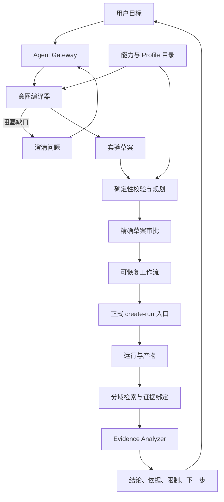

# 目标架构与职责边界

> 文档 ID：`AO-03`
>
> 类型：目标架构（`proposed`）
>
> 前置阅读：[约束与术语](00_GUARDRAILS_AND_GLOSSARY.md)、[当前基线](01_CURRENT_BASELINE_AND_GAPS.md)

## 1. 目标

定义从自然语言目标到正式仿真、再到证据化分析的组件、数据流、所有权和信任边界。目标架构复用现有 Bridge create-run、运行仓库和 Evidence Agent，不建立旁路仿真器。

## 2. 设计原则

- contract-first：跨进程对象先版本化，再生成类型和 validator；
- capability-first：只有正式目录标记为 executed 的字段才可进入运行草案；
- deterministic core：数值、单位、约束、身份、审批、幂等和 citation 由代码裁决；
- least privilege：每个 workflow node 只得到当前步骤需要的 typed tool；
- evidence before prose：运行事实先被校验和绑定，LLM 只组织允许范围内的叙述；
- durable boundary：长任务通过 operation/event/checkpoint 恢复，不依赖浏览器内存；
- single execution path：正式副作用最终只进入场景与探索编排模块/Bridge 的受控入口。

## 3. 逻辑组件

| 组件                            | 输入                               | 输出                                    | 所有者                 | 不得负责                                   |
| ------------------------------- | ---------------------------------- | --------------------------------------- | ---------------------- | ------------------------------------------ |
| Agent Gateway                   | authenticated conversation request | turn/stream/operation envelope          | Bridge API             | 业务推理、任意工具代理                     |
| 能力与 Profile Catalog          | revisioned descriptors/profiles    | 可查询能力快照                          | 后端/Bridge contract   | 从 UI 或 prompt 推断能力                   |
| Intent Compiler                 | user turn、goal、catalog snapshot  | typed slots、draft patch、clarification | Agent service          | 提交 run、计算物理指标                     |
| Deterministic Validator/Planner | draft、profiles、budget、policy    | validation report、bounded candidates   | 后端领域服务           | 生成自然语言事实                           |
| Approval Service                | draft/validation digest、principal | approval envelope                       | Bridge/权限层          | 批准变化后的草案                           |
| Workflow Engine                 | approved snapshot、typed tools     | operation/events/checkpoints            | Bridge 服务层          | 重新定义仿真语义                           |
| Create-run Adapter              | approved compiled request          | formal run identity                     | 现有场景与探索编排入口 | 接收自由文本或任意 CLI                     |
| Retrieval Service               | scoped query、index revisions      | evidence bundle                         | Bridge evidence 层     | 写 run、提升 provenance                    |
| Evidence Analyzer               | validated evidence bundle          | atomic claims/citations                 | Evidence Agent 路径    | 重算报告、合并 claims                      |
| Web Workspace                   | contracts/view models              | 对话、草案、审批、运行、证据 UI         | Web feature            | 保存敏感 raw payload、执行第二套 validator |
| Agent Copilot Shell             | page context refs、typed blocks    | 跨页面右侧对话栏和用户动作              | Web App Shell          | 拥有业务状态、抓取 DOM、直接调用 Provider  |

组件名称是逻辑责任名，不是已经发布的 API identity。

## 4. 数据流

任何从意图编译器直接连到仿真执行器、或从 LLM 直接连到数据库/CLI 的实现都违反该边界。

## 5. 与现有系统的关系

### 5.1 现有 create-run

`tilesim.bridge.create_run_request.v1` 继续是当前正式运行输入。Phase 1 草案编译器必须调用与手工表单相同的 request builder，并证明 canonical payload 等价。模型、设备、TP/PP/EP 等新字段只有在 Bridge 发布正式 successor 或工作负载描述语言托管入口后才能执行。

### 5.2 当前 Evidence Agent

`tilesim.bridge.evidence_agent_descriptor.v2` 与 request/response/citation/snapshot v1 保持独立兼容面。当前页面分析当前 run 的单轮任务；未来会话不得偷偷复用它表达 turn history、tool call、cancel 或 comparison。

### 5.3 后端结构化 Agent 编排

现有 `tilesim.agent.structured_intent.v1alpha1` 可作为冻结输入、固定工具序列、digest 和 fail-closed provenance 的实现参考。它不是目标 conversation contract，也不接收自由语言。

## 6. 模块所有权

| 语义                         | 权威所有者                     | Agent 可做的事                         |
| ---------------------------- | ------------------------------ | -------------------------------------- |
| 工作负载与请求               | 工作负载抽象与负载描述语言模块 | 收集目标、选择模板、生成待校验草案     |
| batch/调度/模型调用          | 推理引擎与服务运行时模块       | 选择已发布语义 profile 和参数          |
| 执行片段/并行 lowering       | 执行语义建模模块               | 展示编译结果，不自行拆分或推断         |
| 逻辑 KV 策略                 | 推理引擎与服务运行时模块       | 配置受支持策略                         |
| 物理 KV 页、容量、驻留和迁移 | KV Cache 建模模块              | 消费 validator/结果，不复制状态机      |
| 设备 timing/resource         | 设备性能建模模块               | 绑定 versioned profile，不猜性能       |
| 集合通信                     | 集合通信语义模块               | 选择声明的算法/语义，不造通信量        |
| 路径、队列、拥塞和反压       | 网络与硬件资源模块             | 配置拓扑/链路，解释正式网络证据        |
| 时间轴、fidelity 和执行      | 仿真执行与控制平面             | 请求运行、监控 operation，不改物理语义 |
| 校准、验证和归因             | 校准验证与指标归因模块         | 限定 claim scope、比较兼容性和引用     |

## 7. 前后端职责

### 7.1 Web

- 呈现 descriptor/profile/contract；
- 收集用户输入并保持字段 identity；
- 展示 server validation、diff、approval 和 operation；
- 做格式级检查、排序、分组和无损显示；
- 不重新计算模拟指标或决定执行能力。

### 7.2 Bridge

- authentication、authorization、rate/budget limit；
- Schema/runtime validation 和 revision binding；
- conversation/operation 生命周期和幂等；
- typed tool registry、audit event 和 redaction；
- 连接后端正式入口、evidence repository 和 Provider adapter。

### 7.3 后端领域服务

- capability/profile 的执行真源；
- lowering、约束和确定性 calculator；
- 仿真执行、checkpoint、artifact 和 metrics；
- provenance、validation、attribution 和 comparability。

## 8. 依赖方向

允许的依赖为：UI → generated contract/client → Bridge orchestration service → domain service/现有正式入口。领域对象不能依赖 Web view model；Provider adapter 不能成为 profile 或权限真源；MCP/A2A adapter 不能拥有内部业务状态。

前端继续遵守 view 不直接调用 `bridgeApi`、feature 只经公共 `index.ts` 协作、通用 UI 不访问 store/API/schema 的既有规则。

## 9. 状态与身份边界

每次处理至少绑定：

- principal/workspace；
- conversation 和 turn revision；
- capability/profile catalog revisions；
- draft revision 和 canonical digest；
- validation policy/revision 和 digest；
- approval identity、expiry 和 approved digest；
- operation、workflow revision 和 idempotency key；
- run/backend/schema-set/snapshot digest；
- artifact schema/SHA/Pointer/stable subject。

任一上游 revision 改变时，所有依赖对象转为 stale；系统不得静默重算后继续沿用旧 approval 或 claim。

## 10. 失败隔离

| 故障                         | 所属边界                | 处理                                           |
| ---------------------------- | ----------------------- | ---------------------------------------------- |
| Provider 无效输出            | Intent/Evidence Adapter | 正式失败，不进入 draft/run                     |
| catalog/profile drift        | Compiler/Validator      | 草案 stale，要求重新验证                       |
| validation crash             | Deterministic service   | operation 可恢复，不猜结果                     |
| approval 过期                | Approval                | 阻止写工具，保留只读草案                       |
| create-run transport failure | Workflow                | 用同 key 查询/重放，不生成新副作用             |
| process restart              | Workflow                | 从 checkpoint 恢复 node，不重复已提交工具      |
| run identity 变化            | Retrieval/Evidence      | claims stale 并隐藏                            |
| retrieval index 不可用       | Retrieval               | 返回 evidence unavailable，不让 LLM 无依据回答 |

## 11. 安全与数据边界

信任从低到高依次是：用户/文档文本、Provider 输出、检索候选、validated structured object、approved operation、正式 run artifact。低信任内容不能携带权限升级指令。

Provider 只接收任务所需的最小投影；credential、hidden reasoning、完整 artifact payload、原始 Provider response 和跨 workspace 数据不得进入 prompt、日志或持久化。所有写工具都需要服务端权限与审批验证。

## 12. 测试与验收

- contract compatibility 与 generated client drift；
- 同一草案经 UI 和 Agent 编译得到相同 canonical request；
- 每个组件可用 fixture 独立故障注入；
- catalog/profile/draft/approval/run revision stale 传播；
- crash-before/crash-after tool commit 的 exactly-once observable effect；
- Provider、retriever、MCP 不可用时 fail closed；
- 跨 workspace/run 数据隔离；
- 累计链测试覆盖工作负载到请求指标和网络反馈。

## 13. 依赖与更新触发器

依赖 [能力与 Profile 目录](04_CAPABILITY_AND_PROFILE_CATALOG.md)、[工作流](08_WORKFLOW_APPROVAL_AND_EXECUTION.md)、[RAG](09_RAG_EVIDENCE_AND_MEMORY.md) 和 [工具安全](10_TOOLS_SECURITY_AND_INTEROPERABILITY.md)。

代码包、接口和多 Agent 独占范围见 [模块边界与并行开发](15_MODULE_BOUNDARIES_AND_PARALLEL_DEVELOPMENT.md)。逻辑组件可以分别实现，但跨模块只交换版本化对象，不共享可变 store 或 Provider 会话。

跨页面交互通过 [全局右侧 Agent 对话栏](16_RIGHT_SIDE_AGENT_COPILOT_PANEL.md) 编排。每个页面只发布最小、只读、revisioned Context Envelope；全局 Shell 只保存布局和 object references。

新增服务、改变模块所有权、增加写工具、发布 create-run successor、改变 retention 或引入外部 Agent 时必须更新本文并形成 ADR。
