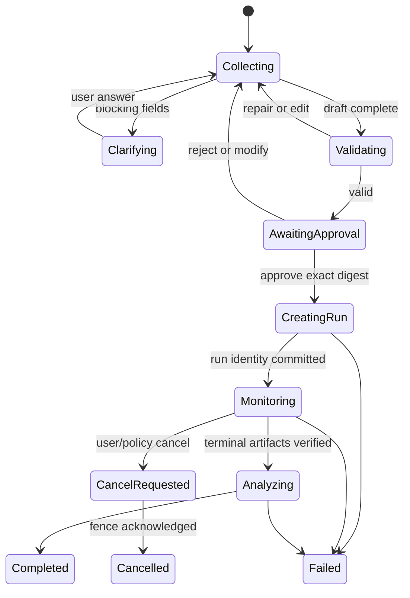

# 工作流、审批与执行规范

> 文档 ID：`AO-08`
>
> 类型：可恢复执行设计（`proposed`）
>
> 前置阅读：[会话与草案契约](05_CONVERSATION_AND_DRAFT_CONTRACTS.md)、[确定性校验](07_DETERMINISTIC_VALIDATION_AND_PLANNING.md)

## 1. 目标

把“草案 → 校验 → 审批 → 创建运行 → 监控 → 分析”实现为显式、可恢复、可审计的 typed workflow。系统在重试、崩溃、网络中断、取消和迟到响应下不得重复 Provider 调用或 run 副作用。

## 2. 非目标

- 不用 LLM 自由决定下一工具；
- 不让浏览器承担唯一 workflow 状态；
- 不承诺对外部系统实现无法证明的 exactly-once；
- 不把 Provider timeout、用户取消和仿真失败合并成一个状态；
- 不在当前 Evidence Agent lease 上模拟新工作流。

## 3. Workflow Graph

Clarifying、approval 和运行等待是正式状态，不通过阻塞线程维持。

## 4. 节点契约

每个 node 声明：typed input/output、允许工具、read/write class、idempotency strategy、timeout、retry policy、checkpoint boundary、compensation/cancel support、public event 和 redaction policy。

建议节点：

1. accept turn；
2. compile intent；
3. await clarification；
4. deterministic validate/plan；
5. await approval；
6. create run；
7. monitor run/artifacts；
8. retrieve evidence；
9. analyze evidence；
10. publish result/next-draft candidate。

## 5. 审批门禁

提交前必须展示并绑定：

- exact draft/compiled request digest；
- 与上个草案的 field-level diff；
- capability/profile/backend/schema/workflow revisions；
- candidate/run 上限、fidelity、execution mode；
- 预计等待/成本及 unknown；
- provenance 和允许 claim scope；
- 将产生的副作用与可取消边界。

Approval 服务端验证 principal、scope、expiry 和全部 digest。任何编辑、revision drift 或预算扩大使批准 stale。

## 6. 副作用分级

| 级别 | 行为                          | 是否需批准             |
| ---- | ----------------------------- | ---------------------- |
| R0   | catalog/profile/manifest 读取 | 否，受访问控制         |
| R1   | 纯计算、校验和草案预览        | 否，无副作用           |
| R2   | 会话/草案保存                 | 需要 retention consent |
| W1   | 创建单个受控 run              | 是，绑定精确 digest    |
| W2   | 批量候选/高成本运行           | 是，额外预算和数量上限 |
| W3   | 外部系统写入或发布            | 面试版默认不开放       |

任何“再次尝试”都不能自动扩大副作用等级或预算。

## 7. 幂等与提交协议

- idempotency key 由可信服务生成，Provider/LLM 不参与；
- key 绑定 operation/node/tool、canonical payload digest 和 principal；
- same key/same payload 返回已记录结果或正式恢复状态；
- same key/different payload 返回冲突并锁定 key；
- 创建 run 后先持久化 authoritative run identity，再发布成功 event；
- transport 不确定时先查询既有提交，不生成新 key；
- 显式用户“新建实验”才产生新 draft/approval/key。

外部接口若没有幂等能力，适配器必须使用 durable outbox/commit record 和可查询业务 identity；仍无法安全证明时禁止自动重试。

## 8. Checkpoint 与崩溃恢复

Checkpoint 只保存恢复所需的 typed state、object references、digests、node outcome 和 tool commit record，不保存 hidden reasoning/raw Provider response。

每个有副作用节点必须测试：

- 调用前崩溃；
- 外部提交后、本地记录前崩溃；
- 本地记录后、event 发布前崩溃；
- event 发布后重复消费；
- 服务重启和客户端重连。

恢复时重新校验 approval expiry、revisions 和权限。已提交副作用不可因 approval 后来过期而删除，但不能继续新的未批准步骤。

## 9. Retry Policy

Retry 是 node-specific：

- 纯读/纯计算可有限指数退避；
- Provider 调用只有明确请求 identity 和 retention/replay contract 时才可重放；
- create-run 只用同 key 查询/精确 replay；
- validation/profile drift 不重试，转 stale；
- 4xx contract/permission 错误不重试；
- 502/503/504 保持各自正式终态和策略。

全局 retry 上限、wall-clock 和 budget 必须可审计。

## 10. 取消

取消流程：记录 `cancel_requested_at` → 建立 cancel fence → 向支持取消的当前工具发送一次请求 → 等待 acknowledgment 或进入 `cancel_pending/unknown` → 隔离 fence 后的 late events/results。

必须区分：

- 尚未产生副作用的取消；
- run 已创建但后端可取消；
- 后端不可取消、只停止后续 Agent 步骤；
- Provider timeout；
- workflow policy timeout。

UI 不能在后端仍运行时声称“运行已取消”。

## 11. 进度与流式

Operation events 可通过 SSE 或 polling 传输，但 transport 不是领域状态。客户端使用 operation ID + event sequence 去重和续读；缺口时重新获取 operation snapshot。

只流式展示用户可见文本和稳定 progress event。未完成 claims 不进入正式结果；断流不等于 operation 失败。

## 12. 结果分析衔接

只有 run terminal、artifact manifest 完整、bytes/SHA/schema/run binding 校验通过后才进入 evidence retrieval。分析 snapshot 固定 run/backend/schema/artifact identities。

当前 Evidence Agent 的 lease/stale/409/502/503/504 规则继续独立适用。未来工作流若复用其 endpoint，必须把返回作为一个不可变 node result，不修改旧协议语义。

## 13. 错误语义

至少区分：clarification_required、validation_failed、approval_required/expired/stale、permission_denied、budget_exceeded、tool_unavailable、idempotency_conflict、commit_state_unknown、run_failed、cancel_not_supported、cancel_pending、provider_invalid_output/unavailable/timeout、evidence_invalid 和 workflow_internal_failure。

每个错误包含 terminal/retryable/user_action、failed node、safe checkpoint 和 side-effect summary。

## 14. 安全与留存

- workflow worker 使用短期、最小权限 capability token；
- approval 与工具权限在服务端再次检查；
- checkpoint/event payload allow-list；
- 日志只记录 ID、digest、状态、耗时和 redacted error；
- credential 不进入 state、event、trace 或 prompt；
- operation 到期后按 policy 删除可删 state，保留必要审计 receipt。

## 15. 测试与验收

- graph 每个合法/非法 transition；
- approval 前 create-run 调用数=0；
- same key/same payload observable side effect=1；
- same key/different payload 正式冲突；
- 每个 node 的 crash matrix 和重启恢复；
- timeout/retry/budget exhaustion；
- cancel fence 和 late terminal isolation；
- SSE 断开、event duplicate/gap/out-of-order；
- profile/schema/backend drift；
- permission/retention/workspace isolation；
- 现有 Evidence Agent 两类 409 和 lease 行为不回归。

## 16. 依赖与更新触发器

正式实现依赖 `GAP-APPROVAL-001`、`GAP-WORKFLOW-001` 及 create-run 的可靠幂等查询。引入新 node/tool/side effect、修改取消或 retry 语义、改变 checkpoint/retention 时必须更新本文、[工具安全](10_TOOLS_SECURITY_AND_INTEROPERABILITY.md) 和 [评测](11_EVALUATION_OBSERVABILITY_AND_ACCEPTANCE.md)。
