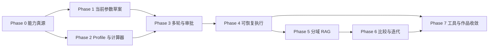

# 交付路线图与工作包

> 文档 ID：`AO-12`
>
> 类型：实施计划（`proposed`）
>
> 前置阅读：[当前基线](01_CURRENT_BASELINE_AND_GAPS.md)、[目标架构](03_TARGET_ARCHITECTURE_AND_OWNERSHIP.md)、[评测](11_EVALUATION_OBSERVABILITY_AND_ACCEPTANCE.md)

## 1. 目标

按“先能力真源和确定性闭环，后多轮、执行、RAG 和互操作”交付可独立验收的增量。工期是单一主要开发者的规划区间，不是承诺日期；后端累计链或真实数据未满足时，不以前端模拟追赶排期。

## 2. 全局依赖

模型/设备/并行的后端累计执行链是 Phase 2 的外部前置，不由本模块自行宣布完成。

## 3. Definition of Ready

工作包进入实现前必须具备：

- stable requirement/GAP ID 和 owner；
- 当前事实与目标行为；
- 输入/输出 Schema 草案及兼容策略；
- capability/profile/execution evidence；
- failure、stale、permission、retention 语义；
- deterministic oracle 和至少一条负例；
- 修改范围、依赖、回滚和测试计划；
- 不触碰用户服务/credential 的操作说明。

## 4. Definition of Done

- contract/schema/runtime validator/generated types 同步；
- module-local、adjacent conversion 和累计链测试；
- failure injection、security、redaction/retention；
- 文档状态从 proposed/gap 精确更新；
- 用户可见能力与 runtime descriptor 一致；
- 阶段 eval report 和已知限制；
- 全仓门禁通过，未部署/停止 5173，除非另有授权；
- 无擅自 commit/push，未覆盖共享工作树改动。

## 5. Phase 0：能力真源与现状收口（约 2 周）

目标：系统能准确回答“当前能做什么”。

工作包：

- `WP-CAP-01` 汇总 parameter descriptors 和稳定 field IDs；
- `WP-CAP-02` accepted/validated/lowered/executed/observable 矩阵；
- `WP-PROFILE-01` 五类最小 Profile Schema；
- `WP-CAP-03` catalog snapshot/revision/digest 和 drift checks；
- `WP-TRACE-01` 字段 → request Pointer → lowering → test → artifact traceability；
- `WP-EVAL-01` 首批双语意图、unsupported 和 boundary dataset。

退出条件：每个 agent-exposed 字段有执行证据；未执行字段不能进入推荐；profile 缺失明确 fail closed；源码与目标 runtime
contract identity/同 key 语义无未裁决 drift（`GAP-CONTRACT-DRIFT-001` 关闭）。

Phase 0B 历史检查点（2026-09-08）：publication candidate 与独立 oracle 已完成，但正式 publication、immutable runtime
snapshot、generated types/validators 和 Bridge endpoint 未完成；F8 v1 breaking drift 与目标源码 revision 未收口。因此本阶段
当时退出条件未满足，Phase 1 DoR 为 `blocked`。

Phase 0C 历史检查点（2026-09-09）：F8 nested v1/v2 双版本矩阵、正式 Capability/Profile 契约、immutable snapshot
service/endpoint、generated types/runtime validators、Web 只读 adapter 和独立 oracle 已闭合。实现层 DoR hard gates
达到 pre-commit ready；随后由 Phase 0D 完成 Git 可复现发布。

Phase 0D 发布状态（2026-09-09）：八字段 execution evidence 已形成独立后端 commit
`7e5a8c6a5cf738bd24608b440a61b62dee8d1881`，Catalog 八条 repository/revision/path/test_case reference 为
8/8 verified。Web runtime/reproducibility commits `64a741f3…` / `df1f2445…` 已形成，其 snapshot revision 为
`sha256:2411a70b…673a0`，F8 compatibility 为 28/28，oracle tests 为 5/5；docs/evidence commit 为
`b46b9783bdd8a8ed330cffe549327e4e381b6f03`。Phase 0 技术 DoR 已闭合。

## 6. Phase 1：当前正式参数面的自然语言草案（约 2–3 周）

目标：自然语言配置当前八参数和严格受控子集，无 run 副作用。

工作包：

- `WP-DRAFT-01` Goal/Draft/ValueSource 内存态原型；
- `WP-COMPILER-01` task routing、slot、alias、unit normalization；
- `WP-VALIDATE-01` 复用正式 descriptor 和 request builder；
- `WP-UX-01` 对话 + 草案 + validation 三区域；
- `WP-COPILOT-01` 只读右侧 Shell、Context Envelope 和当前能力说明；
- `WP-EVAL-02` 100+ 中英案例、歧义和 unsupported；
- `WP-COMPAT-01` 与手工表单 canonical payload 等价测试。

退出条件：Schema/unit/pointer/equivalence hard gates=100%；确认入口禁用；用户知道这只是草案。

发布状态（2026-09-10）：Phase 1 已完成并集成本地 `main`。八字段覆盖与 canonical equivalence 均为 8/8，
128/128 双语及混合意图评测通过；草案仍无 run 副作用。正式 Draft、Validation、Conversation、Approval、Workflow、
RAG 和写工具 contract 继续保持 open，不自动进入 Phase 2。

## 7. Phase 2：模型、设备、并行与工作负载（约 3–5 周）

前置：后端正式发布 model/device/engine/topology/workload profiles 和 create-run successor/工作负载 intake；TP/PP/EP、KV、集合通信和网络有累计链。

工作包：

- `WP-PROFILE-02` 真实 profile registry/fixtures 和证据来源；
- `WP-CALC-01` weight/memory/KV calculators；
- `WP-CALC-02` parallel/placement/collective validator；
- `WP-WORKLOAD-01` request distribution/template compiler；
- `WP-NET-01` topology/network capability resolver；
- `WP-SLO-01` typed SLO 和预算规划；
- `WP-LOWER-01` draft 到正式运行输入的累计转换。

退出条件：不可行组合 fail closed；未知 profile 不猜；结果能累计到网络与请求指标；synthetic 不升级。

DoR checkpoint（2026-09-11）：14 项审计已完成，完整 Phase 2 为 `blocked`，仅既有 Phase 1 八字段切片为
`partially_ready`。五类正式 Profile 记录均为 `0/unavailable`，create-run successor/正式 workload intake、七类
versioned calculator receipt、Phase 2 Validation Report，以及 card/TP/PP/EP/placement/物理 KV/集合通信/网络的
正式累计 lowering 均未闭合。停止 `WP-PROFILE-02` 至 `WP-LOWER-01` 和 Web receipt UI 实施；先关闭
`GAP-PROFILE-SUCCESSOR-001`、`GAP-CALCULATOR-001`、`GAP-RUN-INTAKE-001` 及相邻后端执行 Gap，再重新审计 DoR。
证据见 [Phase 2 Definition of Ready 审计](20_PHASE2_READINESS_AUDIT.md)。

Phase 2A 契约设计状态（2026-09-11）：已形成隔离的 `proposal_only` publication candidate，采用五类 Profile v2、
保留顶层 create-run v1 并新增显式 nested run intake v2 的方案，同时冻结 Validation Report、七类 calculator
receipt、compatibility、stale、幂等和留存语义。`GAP-PROFILE-SUCCESSOR-001`、`GAP-RUN-INTAKE-001`、
`GAP-VALIDATE-001`、`GAP-CALCULATOR-001` 仅进入 `designing`；尚未注册正式契约、实现 Bridge runtime 或后端
lowering，也没有真实 Profile、校准或 held-out evidence，因此完整 Phase 2 继续 `blocked`。后续必须先经 Phase 2B
发布评审，再按 Phase 2C 建立累计执行闭环，不能直接启动 Web receipt UI。详见
[Phase 2A 契约候选](21_PHASE2A_CONTRACT_PROPOSAL.md)。

## 8. Phase 3：正式多轮与审批（约 2–3 周）

工作包：

- `WP-CONV-01` Conversation/Turn/Goal contract；
- `WP-DRAFT-02` immutable draft revisions/concurrency；
- `WP-APPROVAL-01` exact digest/expiry/revoke/stale；
- `WP-RETENTION-01` consent/redaction/expiry/delete；
- `WP-UX-02` 主动澄清、字段双向定位和审批预览；
- `WP-COPILOT-02` typed timeline、跨页面连续性和 conversation 接入；
- `WP-EVAL-03` 澄清轮数、stale、并发编辑、安全。

退出条件：旧批准不会授权新草案；跨会话泄漏为 0；无 hidden reasoning/raw response 持久化。

## 9. Phase 4：可恢复执行与取消（约 3 周）

工作包：

- `WP-WF-01` Operation/Event/Checkpoint contract；
- `WP-WF-02` typed workflow graph；
- `WP-IDEM-01` create-run commit record/outbox/recovery；
- `WP-STREAM-01` event sequence + SSE/poll reconnect；
- `WP-CANCEL-01` cancel fence 和 late-result isolation；
- `WP-CHAOS-01` 每节点 crash matrix。

退出条件：approval 前副作用 0；crash/retry 重复副作用 0；取消状态不夸大；所有恢复路径可审计。

## 10. Phase 5：分域 RAG 与证据一体化（约 3–4 周）

工作包：

- `WP-RAG-01` 参数/Profile exact+metadata 索引；
- `WP-RAG-02` current-run validated evidence index；
- `WP-RAG-03` 公开文档 BM25 baseline；
- `WP-RAG-04` retrieval inspector/evidence bundle；
- `WP-CITE-01` atomic claim/citation validator integration；
- `WP-RAG-EVAL-01` 独立检索和 injection corpus；
- `WP-RAG-EXP-01` embedding/reranker bake-off（可选）。

退出条件：exact identity、citation 和 uint64=100%；no-answer false positive=0；语义检索无增益时保持关闭。

## 11. Phase 6：跨运行比较与实验迭代（约 3–4 周）

工作包：

- `WP-COMPARE-01` Comparison Set/Comparability Report；
- `WP-COMPARE-02` input/profile/fidelity/provenance gates；
- `WP-ITERATE-01` run → new draft，保持来源与 diff；
- `WP-BATCH-01` 有界候选和批量审批；
- `WP-DSE-01` 接入当前网络与硬件资源 design-space lane；
- `WP-EVAL-04` 不兼容比较与 citation ownership。

退出条件：comparability bypass=0；每条 citation 保持 owning run；unresolved 字段不参与 ranking。

## 12. Phase 7：有限工具生态与面试作品收敛（约 2–3 周）

工作包：

- `WP-MCP-01` read-only resources/T0-T1 tools；
- `WP-MCP-02` 经审批 create-run tool；
- `WP-OTEL-01` redacted OpenTelemetry + audit events；
- `WP-SEC-01` injection/tool abuse/SSRF/adversarial；
- `WP-DEMO-01` 十分钟脚本、故障注入和离线 fallback；
- `WP-ADR-01` 决策记录和量化报告；
- `WP-REVIEW-01` reviewer Agent bake-off（可选）。

A2A、GraphRAG 和开放多 Agent 不作为面试版前置。

## 13. 优先 Backlog

| 优先级 | 工作项                | 依赖                          | 交付价值              |
| ------ | --------------------- | ----------------------------- | --------------------- |
| P0     | `WP-CAP-01/02/03`     | 后端字段审计                  | 阻止推荐未执行能力    |
| P0     | `WP-PROFILE-01`       | Profile owner                 | 模型/设备等有统一真源 |
| P0     | `WP-DRAFT-01`         | contract design               | 自然语言输出可审计    |
| P0     | `WP-VALIDATE-01`      | capability catalog            | 不让 LLM 负责合法性   |
| P1     | `WP-COMPILER-01`      | alias/unit registry           | 可用的自然语言入口    |
| P1     | `WP-COPILOT-01/02`    | App Shell/context/会话契约    | 跨页面统一 Agent 入口 |
| P1     | `WP-COMPAT-01`        | current request builder       | 证明无旁路语义        |
| P1     | `WP-CALC-01/02`       | 完整 profiles                 | 回答卡数/并行可行性   |
| P1     | `WP-LOWER-01`         | Phase 2 run intake + 后端闭包 | 证明字段真实执行      |
| P1     | `WP-CONV-01`          | retention decision            | 正式多轮澄清          |
| P1     | `WP-APPROVAL-01`      | auth/policy                   | 安全写操作            |
| P1     | `WP-WF-01/02`         | approval/idempotency          | 长任务恢复            |
| P2     | `WP-RAG-01/02/04`     | index contract                | 证据化配置与分析      |
| P2     | `WP-COMPARE-01/02`    | comparability contract        | 跨 run 迭代           |
| P2     | `WP-MCP-01/02`        | stable internal tools         | 现代互操作展示        |
| P3     | GraphRAG/reviewer/A2A | 独立收益证据                  | 可选研究与扩展        |

## 14. 并行与文件所有权

每批最多并行：契约/后端、Web 展示、评测数据三条；共享 Schema、generated client、catalog 和文档入口设单一 owner。并行任务使用独立 worktree 或明确独占文件，最终由集成任务运行全仓门禁。

不得让两个任务同时改全局 i18n、导航、PagePrimer 或同一 contract。当前共享工作树中用户/其他 Agent 改动必须保留。

完整的模块接口、独占范围、冲突热点和合并顺序见 [模块边界与并行开发](15_MODULE_BOUNDARIES_AND_PARALLEL_DEVELOPMENT.md)。每个工作包开始前必须从该文档复制“允许写入/禁止写入/依赖版本/交付证据”到任务提示词。

阶段启动、角色分配、可复制提示词、分层调试和交接验收见 [开发者指导 AI 实施手册](17_DEVELOPER_AI_EXECUTION_PLAYBOOK.md)。

## 15. 风险与暂停条件

| 风险           | 观察信号                    | 暂停条件                |
| -------------- | --------------------------- | ----------------------- |
| UI 领先执行    | 字段可填但无 execution test | 退回 capability gap     |
| Profile 不可信 | 无 revision/source/regime   | 禁止计算器给确定结论    |
| 工作流不可靠   | retry 重复 side effect      | 关闭写能力              |
| RAG 过度工程   | hybrid 不优于 BM25          | 关闭 embedding/reranker |
| 体验复杂       | 澄清轮数/放弃率上升         | 缩小任务和字段面        |
| 面试演示造假   | fixture 被描述为 live       | 分离当前/目标 Demo      |

## 16. 更新触发器

Gap 状态、依赖、phase scope、工期、owner 或验收阈值变化时更新本文。每完成一阶段，记录实际工作包、测试、未完成项和下一阶段 DoR，不把路线图直接改写成 current_fact。
